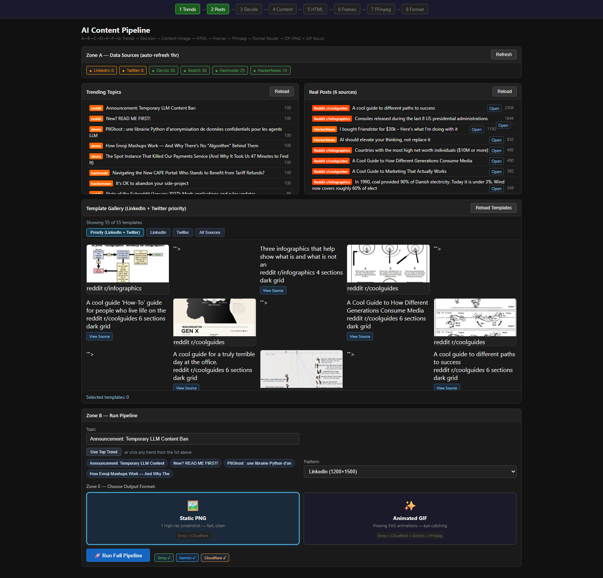
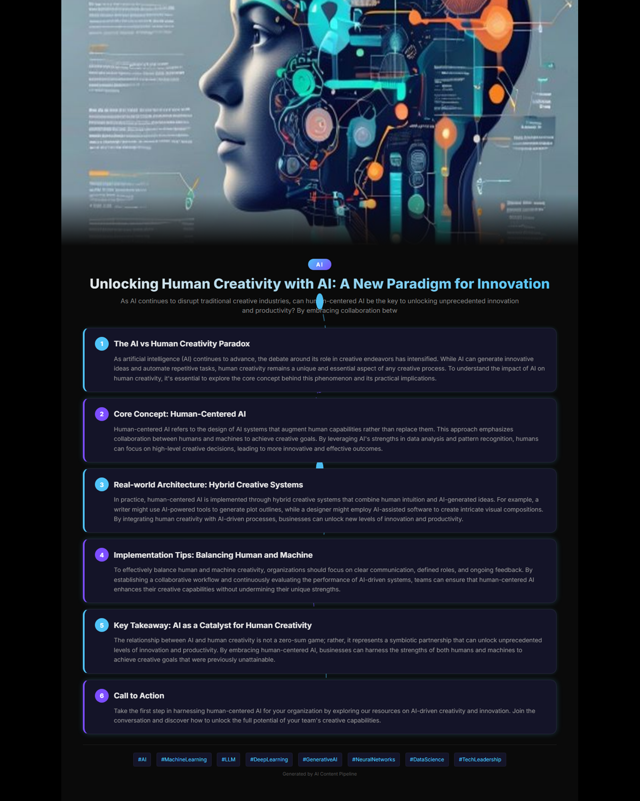
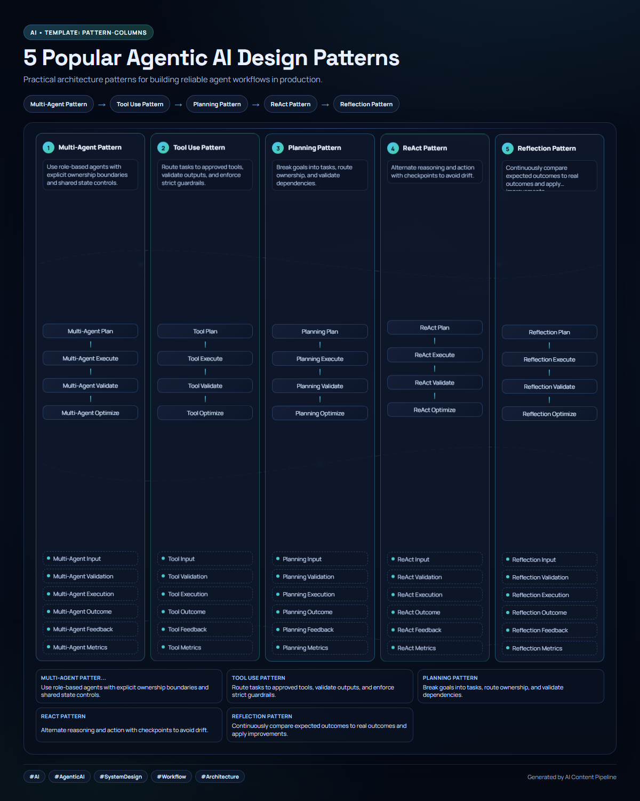
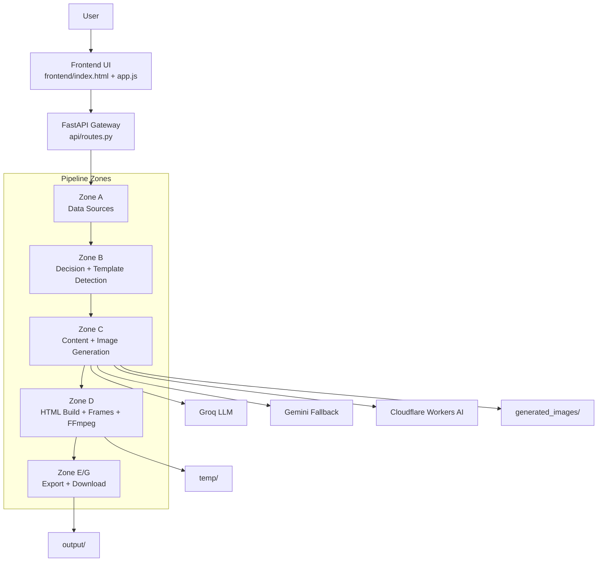
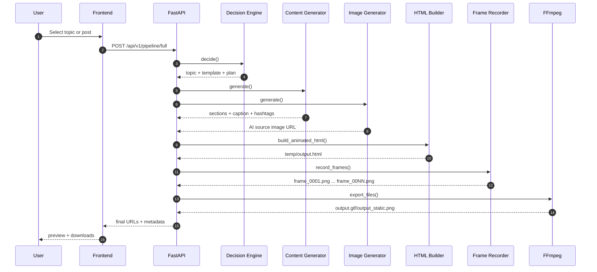
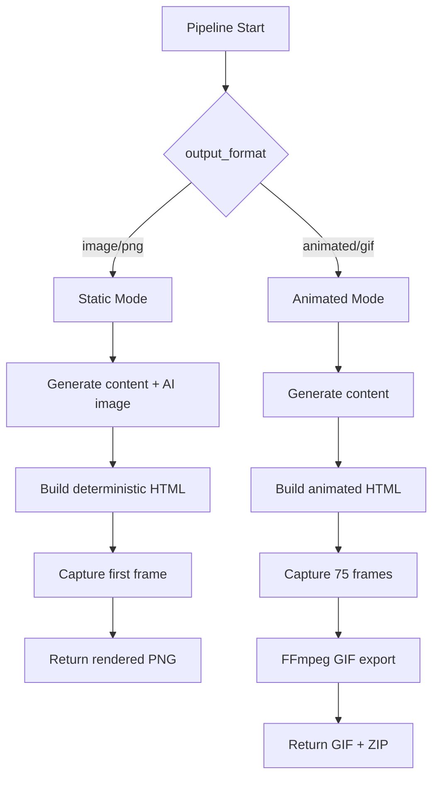

# AI Post Generator

Generate professional social media infographics from real trends and posts.

This project runs a complete AI pipeline from data discovery to final downloadable assets.

Created and maintained by Ashmit Thakur.

- Input: trending topics or selected real posts
- Intelligence: template detection + content planning + AI writing
- Visual output: AI source image + high-quality rendered poster
- Delivery: static PNG, animated GIF, downloadable ZIP package

If this project helps you, please star the repository.

## Table of Contents

- Why This Project
- Product Preview
- System Architecture
- Request Lifecycle
- Output Mode Logic
- Project Timeline
- Core Capabilities
- Prompt Engineering Design
- API Quick Reference
- Quick Start
- Repository Map
- Clean GitHub Push Rules
- Troubleshooting
- Creator
- Final Note

## Why This Project

Most AI post tools only generate text. This system generates complete, production-ready visual posts with a controllable workflow and a browser UI.

## Product Preview

### Frontend Dashboard (Zone A to G)



### AI Source Image (prompt-driven)



### Final Rendered Poster (LinkedIn 1200x1500)



## System Architecture



## Request Lifecycle



## Output Mode Logic



  ## Project Timeline

  ```mermaid
  flowchart LR
    P1[Phase 1\nData Ingestion\nTrendEngine + PostFetcher] -->
    P2[Phase 2\nDecision Intelligence\nTemplate Detector + Planner] -->
    P3[Phase 3\nAI Generation\nGroq/Gemini + Cloudflare] -->
    P4[Phase 4\nRendering Pipeline\nHTML + Frames + FFmpeg] -->
    P5[Phase 5\nExport + UX\nDownloads + Tweak Panel]
  ```

## Core Capabilities

- Multi-source trend and post ingestion.
- Template detection from selected real posts.
- Batched section generation in one LLM call.
- Prompt-driven AI image generation with deterministic style controls.
- Local deterministic HTML layout for stable readability.
- GIF and static image export with browser preview and tweak support.

## Prompt Engineering Design

### Content Prompt

Source file: services/content_generator.py

- Generates all sections in one request.
- Forces strict JSON output contract.
- Uses platform-aware tone and caption shape.
- Includes fallback handling when provider output is invalid.

### Image Prompt

Source file: services/image_generator.py

- Builds prompt using title, category, sections, key points, template style and layout.
- Adds deterministic composition and palette variants from topic hash.
- Enforces anti-gibberish and readability constraints.
- Sends multipart form-data for Flux Klein model compatibility.

### HTML Composition

Source file: services/html_builder.py

- Uses deterministic local layout by default.
- Supports optional Gemini HTML generation.
- Optimized LinkedIn poster layout with:
  - full-height middle utilization
  - structured central node ladders
  - compact bottom insight matrix

## API Quick Reference

| Endpoint | Method | Purpose |
|---|---|---|
| /api/v1/status | GET | Source/cache health |
| /api/v1/trends | GET | Trending topic list |
| /api/v1/posts | GET | Real post feed |
| /api/v1/scraped-templates | GET | Template gallery |
| /api/v1/decide | POST | Topic/template decision |
| /api/v1/generate-content | POST | Section + caption generation |
| /api/v1/generate-image | POST | AI image generation |
| /api/v1/pipeline/full | POST | Full pipeline execution |
| /api/v1/pipeline/html-preview | POST | Rendered HTML preview |
| /api/v1/pipeline/tweak | POST | Apply visual tweaks |
| /api/v1/pipeline/download-zip | GET | Download final package |
| /api/v1/serve-image/{filename} | GET | Serve generated images |
| /api/v1/serve-file/{filename} | GET | Serve generated files |

## Quick Start

### 1) Create virtual environment

```powershell
python -m venv .venv
.\.venv\Scripts\Activate.ps1
```

### 2) Install dependencies

```powershell
pip install -r requirements.txt
playwright install chromium
```

### 3) Configure environment

Copy .env.example to .env and set:

- GROQ_API_KEY
- GEMINI_API_KEY
- CLOUDFLARE_ACCOUNT_ID
- CLOUDFLARE_API_TOKEN
- CLOUDFLARE_IMAGE_MODEL (optional)

### 4) Run application

```powershell
python -m uvicorn main:app --reload --host 127.0.0.1 --port 8000
```

Open:

- Frontend: http://127.0.0.1:8000/
- Swagger docs: http://127.0.0.1:8000/api/docs

## Example Full Pipeline Request

```bash
curl -X POST http://127.0.0.1:8000/api/v1/pipeline/full \
  -H "Content-Type: application/json" \
  -d '{
    "topic": "Agentic AI system design patterns",
    "platform": "linkedin",
    "output_format": "image",
    "include_ai_image": true,
    "selected_templates": [],
    "tweaks": {}
  }'
```

## Repository Map

```text
api/                  FastAPI endpoints and orchestration
config/               App settings and environment config
frontend/             Browser UI (HTML/CSS/JS)
models/               Pydantic schemas
services/             Pipeline logic (Zones A-G)
utils/                Shared utility helpers
docs/assets/          README image assets
generated_images/     Runtime generated images
temp/                 Runtime intermediate artifacts
output/               Runtime exported packages
```

## Clean GitHub Push Rules

Runtime and local artifacts are ignored:

- temp/**
- output/**
- generated_images/**
- .venv/
- caches and logs

Tracked placeholders keep folder structure:

- temp/.gitkeep
- temp/frames/.gitkeep
- output/.gitkeep
- output/linkedin/.gitkeep
- generated_images/.gitkeep

## Troubleshooting

- Playwright errors: run playwright install chromium.
- GIF export issues: ensure imageio-ffmpeg is installed from requirements.txt.
- Missing image generation: verify Cloudflare credentials in .env.
- LLM fallback behavior: Groq is primary, Gemini is fallback in content generation.

## Creator

Made by Ashmit Thakur.


## Final Note

This project is built to make AI content creation understandable, controllable, and production-ready.

From trend discovery to final visual export, every stage is designed for clarity, quality, and practical use.

## License

.Copyright (c) 2026 Ashmit Thakur. All rights reserved.

This repository is provided for educational and reference purposes only.

PERMITTED:

* You may view and download the code for personal learning.
* You may fork this repository on GitHub.
* You may submit issues, suggestions, and pull requests.

RESTRICTIONS:

* You may NOT use this code in any personal, academic, or commercial project.
* You may NOT publish, distribute, or re-upload this code (in whole or in part).
* You may NOT use this code to build or showcase your own applications.
* You may NOT claim this code as your own work.

ATTRIBUTION:
If you are explicitly permitted to share any part of this code, you must give clear credit at the beginning:

"Original code by Ashmit Thakur (2026)"

NO LICENSE:
Only the permissions listed above are allowed. Any other use is strictly prohibited.

ENFORCEMENT:
If you violate these terms, the copyright holder may take appropriate legal action.

